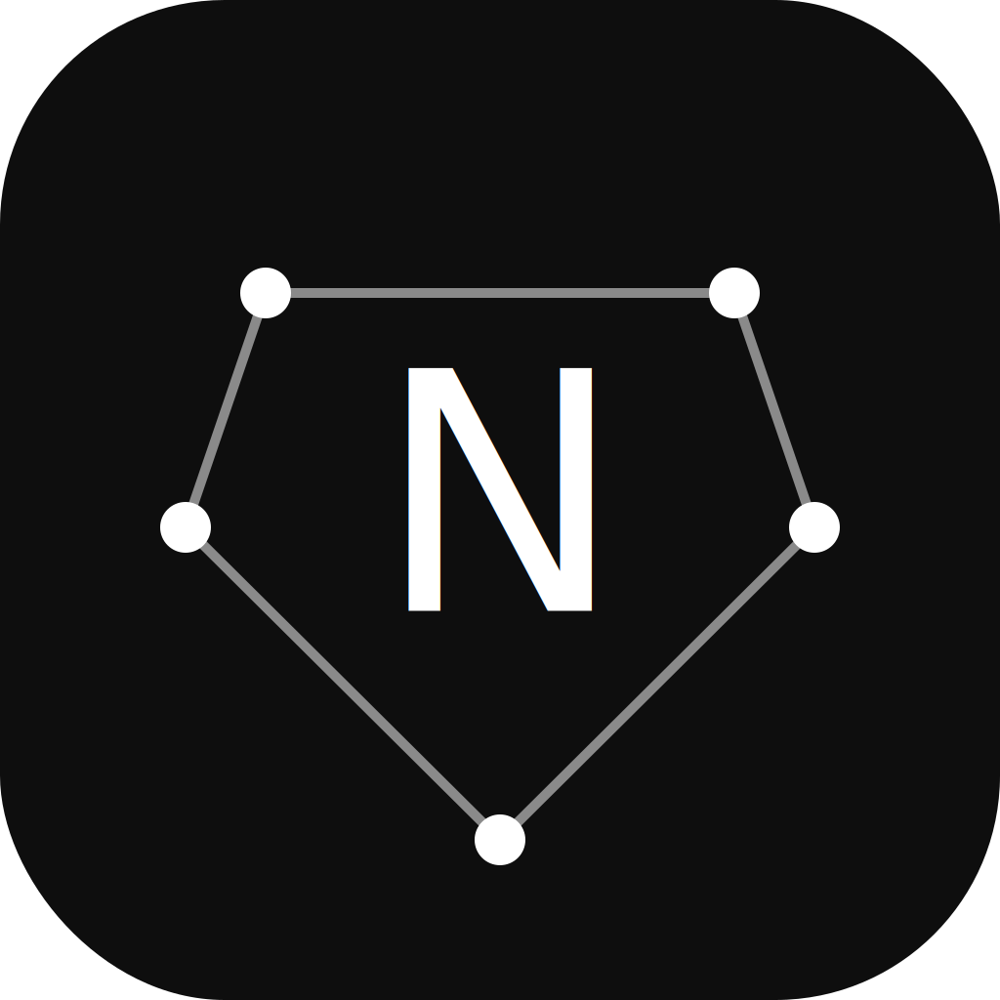

<div align="center">
  
  <h1>NotaraCBR</h1>
  <p><strong>A clean, minimal comic book reader for desktop.</strong></p>

  [](LICENSE)
  [](https://github.com/jrw585jxc/notara-cbr/releases/latest)
  [](https://www.electronjs.org/)

  <br />

  [**Download for Windows (.exe)**](https://github.com/jrw585jxc/notara-cbr/releases/latest) &nbsp;·&nbsp; [View all releases](https://github.com/jrw585jxc/notara-cbr/releases)

</div>

---

NotaraCBR is a desktop comic reader built to get out of the way. Open a file and read — no accounts, no cloud, no subscription. Your library and progress are stored locally.

Supports CBZ, CBR, and PDF with automatic progress tracking, a smooth page-turning reader, and a clean dark UI.

---

## Features

### Library

Your comic collection is organized into a persistent local library. Covers are extracted automatically on import and the app picks up exactly where you left off every time you open a book.

| Feature | Details |
|---|---|
| Formats | CBZ, CBR, and PDF |
| Reading status | Unread, Reading, Completed, On Hold, Dropped |
| Organization | Series grouping, tags, and collections |
| Progress | Per-book page tracking with % complete |
| Sorting | By date added, name, last read, progress, or series |
| Search | Instant full-text search across title, series, publisher, and tags |
| Ratings | 0–5 star ratings per book |

### Reader

The reader is designed to disappear. Controls auto-hide while you're reading and reappear when you need them.

| Feature | Details |
|---|---|
| Navigation | Click side zones, swipe, arrow keys, or the progress bar |
| Page turning | Snap animation with rubber-band resistance at boundaries |
| Fit modes | Fit Height / Fit Width / Original size |
| Zoom | Scroll to zoom toward cursor; drag to pan at any zoom level |
| Progress bar | Drag to scrub — bar tracks cursor smoothly, page updates live |
| Fullscreen | Toggle via button or F11 — hides the taskbar completely |
| HUD | Top and bottom controls fade in on hover, out while reading |

### UI

- 8 accent colors — swap them from the toolbar, applies instantly across the whole UI
- Draggable titlebar in both library and reader views
- Deep dark theme, typographically clean

---

## Keyboard Shortcuts

| Key | Action |
|---|---|
| `→` / `Space` | Next page |
| `←` | Previous page |
| `F` | Cycle fit mode (Height → Width → Original) |
| `+` / `=` | Zoom in |
| `-` | Zoom out |
| `0` | Reset zoom and pan |
| `F11` | Toggle fullscreen |
| `Esc` | Back to library |

---

## Installation

### Windows

1. Download the `.exe` installer from the [latest release](https://github.com/jrw585jxc/notara-cbr/releases/latest).
2. Run the installer and NotaraCBR opens immediately.

> **Windows SmartScreen:** Because NotaraCBR ships without an EV code-signing certificate, Windows may show a SmartScreen warning. Click **More info → Run anyway** to proceed. The source code is fully open and auditable here on GitHub.

### macOS

1. Download the `.zip` from the [latest release](https://github.com/jrw585jxc/notara-cbr/releases/latest).
2. Unzip and drag **NotaraCBR.app** into your Applications folder.
3. On first launch, right-click the app and choose **Open** to bypass the Gatekeeper warning.

> **Gatekeeper:** Notara apps ship unsigned (no paid Apple Developer membership required for open-source distribution). Right-click → Open bypasses this once; after that it opens normally.

---

## Building from source

### Prerequisites

- [Node.js](https://nodejs.org/) 18+
- npm 9+
- Git

### Run in development

```bash
git clone https://github.com/jrw585jxc/notara-cbr.git
cd notara-cbr
npm install
npm run dev
```

This starts Vite (renderer) and Electron concurrently. The app opens automatically.

### Build a distributable

```bash
npm run build
```

Output goes to `dist-electron/`.

### Project structure

```
notara-cbr/
├── electron/
│   ├── main.js         ← Electron main process (window, IPC, file reading)
│   └── preload.js      ← IPC surface exposed to renderer
├── src/
│   ├── components/
│   │   ├── Library.jsx     ← Main library view with sidebar and grid
│   │   ├── Reader.jsx      ← Full comic reader with HUD and swipe engine
│   │   ├── Sidebar.jsx     ← Navigation: status, series, tags, collections
│   │   ├── TopBar.jsx      ← Search, sort, view toggle, accent picker
│   │   ├── ComicGrid.jsx   ← Grid and list views for the library
│   │   ├── ComicDetail.jsx ← Metadata panel for a selected book
│   │   └── PDFReader.jsx   ← PDF.js renderer
│   ├── store/
│   │   └── libraryStore.js ← All library state, persisted to localStorage
│   ├── hooks/
│   │   └── useLibrary.js   ← React hook wrapping the library store
│   ├── utils/
│   │   ├── comicLoader.js  ← CBZ / CBR / PDF parsing via IPC
│   │   └── accentColors.js ← 8-color accent palette and CSS var applicator
│   └── App.jsx
├── public/             ← App icons and logo
└── package.json
```

### Tech stack

| Layer | Technology |
|---|---|
| Shell | Electron 31 |
| Renderer | React 18 |
| Build | Vite 5 |
| Styling | Tailwind CSS 3 |
| State | Custom store + localStorage |
| CBZ parsing | JSZip |
| CBR parsing | node-unrar-js |
| PDF rendering | PDF.js (pdfjs-dist) |

### CBR support note

CBR uses RAR compression. On some systems `node-unrar-js` requires build tools to compile its native bindings:

```bash
# macOS
xcode-select --install

# Windows
npm install --global windows-build-tools
```

CBZ and PDF work regardless. If a CBR file fails to load the app shows an inline error without crashing.

---

## Contributing

Contributions are welcome. NotaraCBR is a small, focused app — the goal is to keep it that way.

1. Fork the repo and create a feature branch.
2. Run `npm run dev` to start the development environment.
3. Make your changes. Keep the scope tight — PRs that do one thing are much easier to review.
4. Open a pull request with a clear description of what changed and why.

If you're planning something large, open an issue first. The priority is keeping the reader fast and minimal.

**Reporting bugs:** Open a GitHub issue. Include your OS, what you did, what you expected, and what actually happened. Screenshots help.

---

## License

MIT © 2026 Notara

You're free to use, modify, and distribute this software. See [LICENSE](LICENSE) for the full text.

---

<div align="center">
  <sub>No accounts. No cloud. Just your comics.</sub>
</div>
